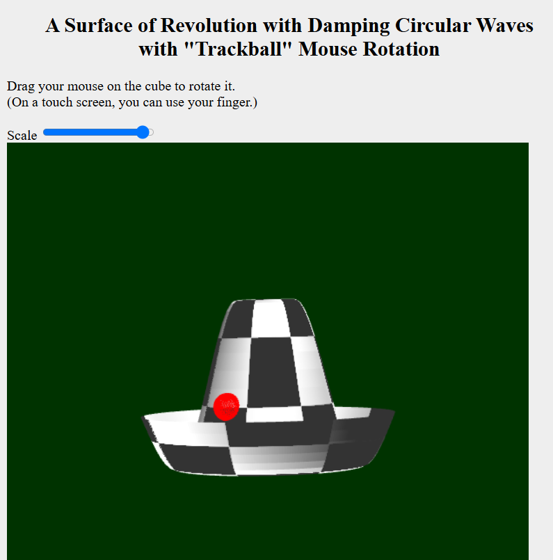
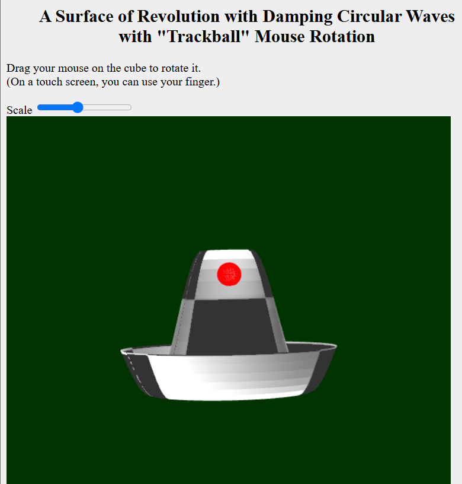

# Calculation and Graphics Work — Texture Scaling

This branch contains the calculation and graphics work completed as part of the VGGI module.

## Assignment Goal

The goal of the assignment was to extend the texture mapping implementation with scaling around a user-controlled point in UV space.

## Added Features

- texture scaling around a selected UV point
- keyboard controls for moving the scaling point along the U and V directions
- real-time texture coordinate transformation

## Controls

- `A` / `D` — move the point along the U direction
- `W` / `S` — move the point along the V direction

## Screenshots

### Texture Scaling

<table>
  <tr>
    <td align="center">
       
      <b>Scaling around the first UV point</b>
    </td>
    <td align="center">
       
      <b>Scaling around the second UV point</b>
    </td>
  </tr>
</table>

## Other Assignments

An overview of all assignments is available in the [`main`](../../tree/main) branch.
