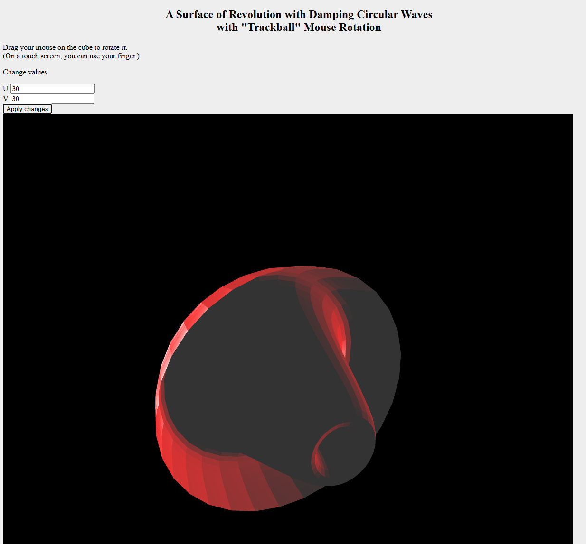
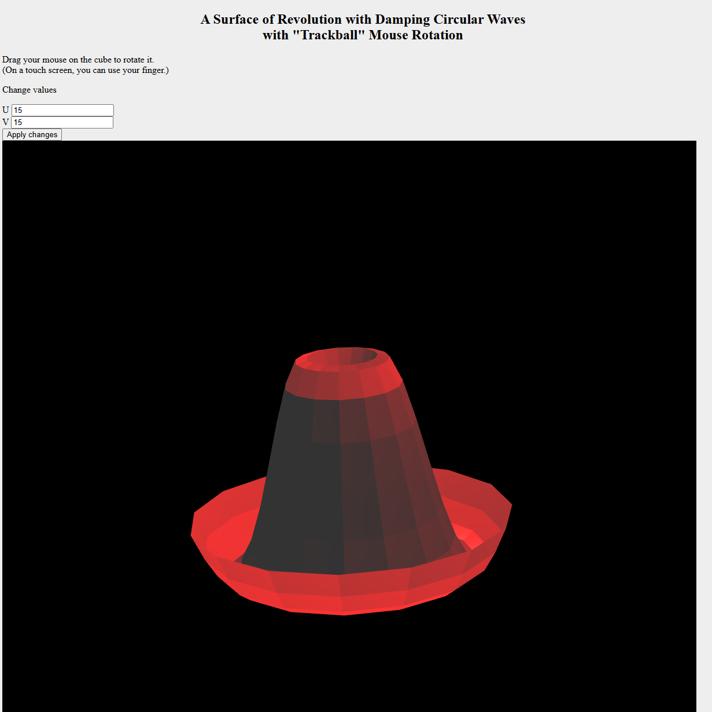
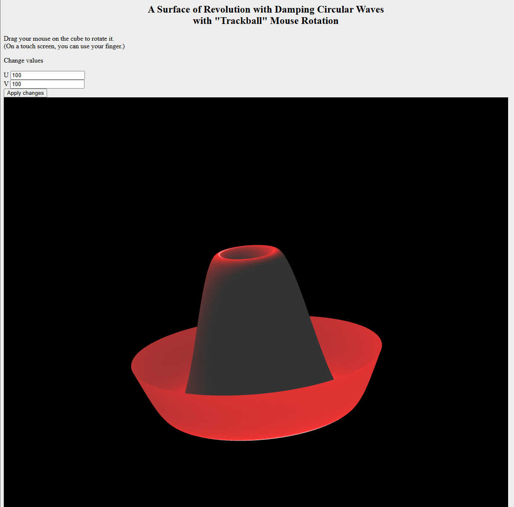

# Assignment 2 — Lighting and Shading

This branch contains the second WebGL assignment completed as part of the VGGI module.

## Assignment Goal

The goal of the assignment was to extend the surface rendering implementation with adjustable surface granularity, vertex normals, lighting, and shader-based shading.

## Implemented Features

- indexed triangle rendering using Vertex Buffer Objects
- adjustable surface granularity along the U and V directions
- facet-average vertex normal calculation
- Phong shading
- ambient, diffuse, and specular lighting
- a point light rotating around the surface
- perspective projection

## Screenshots

### Phong-Shaded Surface

### Adjustable Surface Detail

  
  

## Starter Code

The initial project structure and basic WebGL setup were provided by the course instructor.

The normal calculation, lighting, shading, and assignment-specific modifications were implemented as part of the coursework.

## Other Assignments

An overview of all assignments is available in the [`main`](https://github.com/mistaferry/VGGI-Course/tree/main) branch.
