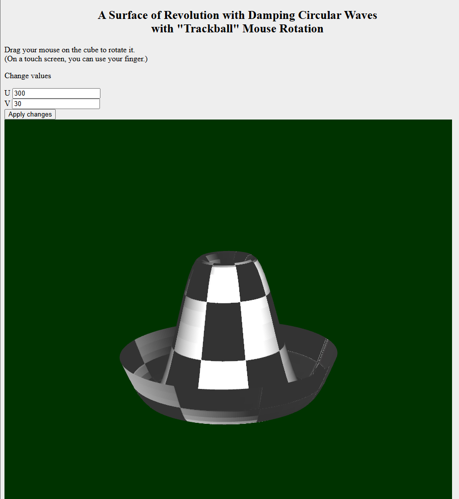

# Assignment 3 - Texture Mapping

This branch contains the third WebGL assignment completed as part of the VGGI module.

## Assignment Goal

The goal of the assignment was to extend the previous lighting implementation with texture mapping.

## Added Features

- diffuse texture mapping
- specular mapping
- normal mapping
- UV texture coordinates
- shader support for texture maps

## Screenshots

### Textured Surface

  

## Texture Maps

<table>
  <tr>
    <td align="center">
       
      <b>Diffuse Map</b>
    </td>
    <td align="center">
       
      <b>Specular Map</b>
    </td>
    <td align="center">
       
      <b>Normal Map</b>
    </td>
  </tr>
</table>

## Starter Code

This assignment builds upon the functionality implemented in the previous branches and the starter project provided by the course instructor.

## Other Assignments

An overview of all assignments is available in the [`main`](../../tree/main) branch.
